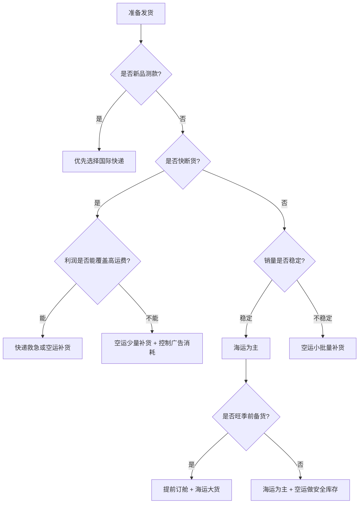

# 跨境电商小白避坑指南：海运、空运、快递到底怎么选？

> 对新手卖家来说，物流不是简单地选“最便宜”或“最快”，而是要在 **成本、时效、库存、风险、利润** 之间做平衡。
> 选错物流方式，轻则利润被吃掉，重则断货、压仓、错过旺季。

---

## 一、先给结论：三种物流方式怎么选？

| 物流方式 | 最适合的场景       | 核心优势         | 最大问题       | 新手建议               |
| ---- | ------------ | ------------ | ---------- | ------------------ |
| 海运   | 大批量、低货值、稳定补货 | 单位成本最低       | 时效慢、压库存    | 适合作为成熟 SKU 的主力补货方式 |
| 空运   | 中小批量、急补货、季节品 | 比海运快，比快递便宜   | 成本较高，旺季波动大 | 适合作为爆款补货和旺季备货缓冲    |
| 国际快递 | 样品、测款、小批量急单  | 门到门、速度快、操作简单 | 单价最高，体积重坑多 | 适合前期测款和紧急救单        |

一句话总结：

```text
测款用快递，补货用空运，稳定大货用海运。
```

---

## 二、海运、空运、快递核心对比表

> 以下为跨境电商常见经验区间，实际以国家、渠道、旺季、清关方式和货物属性为准。

| 对比维度   |      海运 |     空运 |    国际快递 |
| ------ | ------: | -----: | ------: |
| 常见时效   | 25-55 天 | 7-15 天 |   3-7 天 |
| 成本水平   |       低 |     中高 |       高 |
| 适合货量   |     大批量 |   中小批量 |     小批量 |
| 操作复杂度  |      较高 |     中等 |      较低 |
| 清关要求   |      较高 |     较高 |      中等 |
| 库存压力   |       高 |      中 |       低 |
| 断货补救能力 |       弱 |      强 |      最强 |
| 适合新手程度 |      中等 |     中等 |       高 |
| 适合长期使用 |       是 |   部分适合 | 不建议长期依赖 |

---

## 三、用“成本、时效、风险”看三种物流

### 1. 综合评分表

评分说明：5 分为最高，1 分为最低。

| 维度    | 海运 | 空运 | 国际快递 |
| ----- | -: | -: | ---: |
| 成本优势  |  5 |  3 |    1 |
| 时效优势  |  1 |  3 |    5 |
| 操作便利  |  2 |  3 |    5 |
| 适合大货  |  5 |  3 |    1 |
| 适合测款  |  1 |  3 |    5 |
| 旺季稳定性 |  2 |  3 |    4 |
| 库存灵活性 |  1 |  3 |    5 |
| 新手友好度 |  2 |  3 |    5 |

### 2. 可视化对比

| 指标    | 海运      | 空运    | 快递      |
| ----- | ------- | ----- | ------- |
| 成本低   | `█████` | `███` | `█`     |
| 速度快   | `█`     | `███` | `█████` |
| 适合大货  | `█████` | `███` | `█`     |
| 适合小批量 | `█`     | `███` | `█████` |
| 库存灵活  | `█`     | `███` | `█████` |
| 操作简单  | `██`    | `███` | `█████` |

---

## 四、怎么快速判断自己该选哪种物流？

### 决策表

| 你的情况          | 推荐方式      | 原因           |
| ------------- | --------- | ------------ |
| 刚开始测款，不确定能不能卖 | 国际快递      | 小批量、速度快、风险低  |
| 产品已经有销量，但还不稳定 | 空运或快递     | 先保证不断货，再观察数据 |
| 产品稳定出单，销量可预测  | 海运        | 降低单件物流成本     |
| 旺季快到了，海运可能赶不上 | 空运        | 抢销售窗口比省运费更重要 |
| 产品体积大、单价低     | 海运        | 快递和空运容易吃掉利润  |
| 产品体积小、货值高     | 空运或快递     | 成本占比可控，时效更重要 |
| 亚马逊库存快断了      | 空运补货，快递救急 | 保链接排名，避免断货   |
| 客户要样品         | 国际快递      | 轨迹清晰，签收快     |

---

## 五、GitHub 可视化决策树



---

## 六、三种物流方式详细拆解

---

## 1. 海运：适合稳定大货，核心是降低单位成本

海运是跨境电商成熟卖家最常用的主力物流方式，尤其适合已经跑出稳定销量的产品。

### 海运适合什么产品？

| 产品类型  | 是否适合海运 | 原因            |
| ----- | -----: | ------------- |
| 家具类   |     适合 | 体积大，快递成本过高    |
| 健身器材  |     适合 | 重量大，适合大批量运输   |
| 家居收纳  |     适合 | 单价不高，需要压低物流成本 |
| 宠物用品  |     适合 | 稳定补货时成本优势明显   |
| 低货值大件 |   非常适合 | 空运和快递容易亏损     |
| 高货值小件 |    不一定 | 可根据库存节奏搭配空运   |

### 海运优势

| 优势     | 说明                |
| ------ | ----------------- |
| 单位成本低  | 适合大批量发货，摊薄头程成本    |
| 适合大件重货 | 对体积和重量的承载能力强      |
| 适合长期补货 | 成熟 SKU 可以用海运作为主渠道 |
| 利润更稳定  | 物流成本占比降低后，利润空间更好  |

### 海运风险

| 风险      | 具体表现           | 避坑建议       |
| ------- | -------------- | ---------- |
| 时效慢     | 在途时间长，容易影响补货节奏 | 提前 4-8 周规划 |
| 港口拥堵    | 旺季可能延误         | 准备备用渠道     |
| 目的港费用复杂 | 可能产生额外费用       | 报价前确认费用明细  |
| 库存压力大   | 一次发太多容易压货      | 根据销量分批备货   |
| 查验风险    | 清关资料不合规可能延误    | 提前准备完整资料   |

### 海运适用结论

| 适合用海运的条件 | 判断标准      |
| -------- | --------- |
| 产品销量稳定   | 日销量可预测    |
| 货量较大     | 能达到较好装箱效率 |
| 货值不高     | 运费占比需要压低  |
| 不急着上架    | 能接受较长运输周期 |
| 有库存计划    | 不依赖临时补货   |

---

## 2. 空运：适合补货缓冲，核心是防断货

空运不是最便宜，也不是最快，但它是跨境电商中非常重要的“平衡型物流”。

它的价值在于：

```text
比海运快，比快递便宜。
```

### 空运适合什么情况？

| 使用场景     | 是否适合空运 | 原因       |
| -------- | -----: | -------- |
| 爆款快断货    |     适合 | 保护链接权重   |
| 季节品赶销售窗口 |     适合 | 错过旺季损失更大 |
| 新品小批量铺货  |     适合 | 比海运灵活    |
| 高货值小件    |     适合 | 运费占比可控   |
| 大件低货值    |    不适合 | 空运成本过高   |
| 长期大批量补货  |    不建议 | 成本不如海运   |

### 空运优势

| 优势      | 说明         |
| ------- | ---------- |
| 时效较快    | 能快速补充库存    |
| 比快递便宜   | 适合中小批量发货   |
| 适合旺季补货  | 可以弥补海运时效不足 |
| 适合高毛利产品 | 运费占比可控     |

### 空运风险

| 风险       | 具体表现     | 避坑建议      |
| -------- | -------- | --------- |
| 成本波动     | 旺季价格上涨明显 | 提前锁价或分批发货 |
| 体积重影响大   | 轻泡货费用高   | 优化包装尺寸    |
| 清关要求高    | 敏感货可能延误  | 提前确认渠道    |
| 不适合低毛利产品 | 容易吃掉利润   | 先算利润再发货   |

### 空运适用结论

| 适合用空运的条件 | 判断标准         |
| -------- | ------------ |
| 产品快断货    | 库存不足 15-20 天 |
| 毛利较高     | 能覆盖空运成本      |
| 销售窗口短    | 节日品、季节品      |
| 产品不太泡    | 体积重不会过高      |
| 需要快速补货   | 海运赶不上销售节奏    |

---

## 3. 国际快递：适合测款和救急，核心是快和简单

国际快递适合小批量、高时效、高确定性的发货场景。

常见使用场景包括：

| 场景      |  是否适合快递 |
| ------- | ------: |
| 寄样品给客户  |      适合 |
| 新品测款    |      适合 |
| 小批量急单   |      适合 |
| 高货值小件   |      适合 |
| 亚马逊紧急补货 | 适合，但成本高 |
| 大批量常规补货 |     不适合 |
| 大件低货值产品 |     不适合 |

### 快递优势

| 优势    | 说明        |
| ----- | --------- |
| 速度快   | 适合急单和样品   |
| 门到门服务 | 操作简单，新手友好 |
| 轨迹清晰  | 方便追踪和处理异常 |
| 小批量灵活 | 不需要很大起运量  |

### 快递风险

| 风险      | 具体表现        | 避坑建议       |
| ------- | ----------- | ---------- |
| 运费高     | 单件成本容易失控    | 只用于测款或急单   |
| 体积重坑多   | 泡货费用高       | 发货前测算体积重   |
| 附加费多    | 偏远费、燃油费、超长费 | 报价前问清楚是否全包 |
| 长期依赖风险大 | 利润被物流吃掉     | 成熟后转空运或海运  |

### 快递适用结论

| 适合用快递的条件 | 判断标准     |
| -------- | -------- |
| 数量少      | 样品或小批量订单 |
| 时间很急     | 客户或平台要求快 |
| 产品货值高    | 运费占比可接受  |
| 操作要简单    | 不想处理复杂流程 |
| 用于测款     | 不确定市场反馈  |

---

## 七、物流选择公式：新手直接套用

### 公式 1：新品测款

```text
快递小批量测款 → 空运小批量补货 → 海运大货稳定供应
```

适合阶段：

| 阶段     | 物流方式 | 目标        |
| ------ | ---- | --------- |
| 第 1 阶段 | 快递   | 快速上架，测试市场 |
| 第 2 阶段 | 空运   | 防止初期断货    |
| 第 3 阶段 | 海运   | 降低成本，稳定利润 |

---

### 公式 2：成熟爆款

```text
海运 70%-90% + 空运 10%-30% + 快递应急
```

| 物流方式 | 在成熟 SKU 中的角色 |
| ---- | ------------ |
| 海运   | 主力补货，降低成本    |
| 空运   | 补库存缺口，防断货    |
| 快递   | 极端紧急情况下救链接   |

---

### 公式 3：季节品

```text
提前海运备货 + 临近旺季空运补货 + 快递处理急单
```

| 时间节点       | 推荐动作      |
| ---------- | --------- |
| 旺季前 2-3 个月 | 海运大货      |
| 旺季前 3-5 周  | 空运补缺口     |
| 旺季中        | 快递处理紧急订单  |
| 旺季后        | 控制库存，避免压仓 |

---

## 八、案例分析：不同产品怎么选？

---

## 案例 1：低货值大件产品

| 项目   | 情况    |
| ---- | ----- |
| 产品   | 折叠收纳箱 |
| 单价   | 较低    |
| 体积   | 较大    |
| 利润   | 中低    |
| 销量   | 稳定    |
| 推荐物流 | 海运    |

### 选择原因

| 判断点  | 分析        |
| ---- | --------- |
| 体积大  | 快递和空运成本过高 |
| 单价低  | 无法承受高运费   |
| 销量稳定 | 适合提前备货    |
| 利润有限 | 必须压低物流成本  |

### 建议方案

```text
海运为主，提前备货，重点优化外箱尺寸和装柜率。
```

---

## 案例 2：高货值小件产品

| 项目   | 情况          |
| ---- | ----------- |
| 产品   | 小型电子配件      |
| 单价   | 较高          |
| 体积   | 小           |
| 利润   | 较高          |
| 销量   | 不稳定增长       |
| 推荐物流 | 快递测款 + 空运补货 |

### 选择原因

| 判断点    | 分析         |
| ------ | ---------- |
| 体积小    | 快递和空运费用可控  |
| 货值高    | 能承受较高物流成本  |
| 销量不稳定  | 不适合一开始大量海运 |
| 需要快速补货 | 空运比海运更灵活   |

### 建议方案

```text
前期快递测款，中期空运补货，稳定后再考虑海运。
```

---

## 案例 3：节日季节性产品

| 项目     | 情况            |
| ------ | ------------- |
| 产品     | 圣诞装饰灯         |
| 销售周期   | 短             |
| 旺季集中   | 是             |
| 错过时间风险 | 高             |
| 推荐物流   | 海运提前备货 + 空运补货 |

### 选择原因

| 判断点     | 分析       |
| ------- | -------- |
| 销售窗口短   | 不能只看运费   |
| 旺季集中爆发  | 需要提前备货   |
| 错过旺季损失大 | 空运成本可能值得 |
| 库存风险高   | 不宜盲目压太多货 |

### 建议方案

```text
旺季前用海运备主货，旺季中用空运补缺口，避免断货和压仓。
```

---

## 九、小白最容易踩的 10 个坑

| 坑点       | 具体表现         | 解决方案       |
| -------- | ------------ | ---------- |
| 只看头程报价   | 报价便宜，落地费用很高  | 问清全链路费用    |
| 不算体积重    | 货不重但运费很高     | 发货前计算体积重   |
| 不做库存计划   | 货还在路上，链接断货   | 建立安全库存     |
| 长期依赖快递   | 销量越高亏得越多     | 成熟后切换海运    |
| 海运不提前订舱  | 旺季没舱位，价格暴涨   | 提前 4-8 周规划 |
| 不确认包税方式  | 到港后产生额外税费    | 明确是否包税包清关  |
| 忽略敏感货属性  | 带电、液体、粉末被卡   | 发货前确认渠道    |
| 包装不优化    | 体积重过高        | 压缩包装，优化外箱  |
| 没有备用货代   | 一个渠道出问题全盘受影响 | 准备多个物流方案   |
| 不看平台入仓时间 | 货到海外但迟迟不上架   | 预留入仓和上架缓冲  |

---

## 十、发货前必须确认的费用清单

### 海运费用清单

| 费用项目      | 是否必须确认 |
| --------- | -----: |
| 国内提货费     |      是 |
| 出口报关费     |      是 |
| 海运费       |      是 |
| 目的港费用     |      是 |
| 清关费       |      是 |
| 关税        |      是 |
| 拖车费       |      是 |
| 仓库预约费     |      是 |
| 查验费承担方    |      是 |
| 滞港费/滞箱费规则 |      是 |

### 空运费用清单

| 费用项目    | 是否必须确认 |
| ------- | -----: |
| 提货费     |      是 |
| 空运费     |      是 |
| 燃油附加费   |      是 |
| 清关费     |      是 |
| 关税      |      是 |
| 派送费     |      是 |
| 体积重计算方式 |      是 |
| 敏感货附加费  |      是 |

### 快递费用清单

| 费用项目    | 是否必须确认 |
| ------- | -----: |
| 首重续重    |      是 |
| 燃油附加费   |      是 |
| 偏远地区附加费 |      是 |
| 超长超重费   |      是 |
| 清关服务费   |      是 |
| 代垫税费手续费 |      是 |
| 是否门到门   |      是 |
| 是否包税    |      是 |

---

## 十一、物流成本怎么粗略计算？

### 基础公式

```text
单件物流成本 = 总物流费用 / 可售商品数量
```

### 更完整的利润测算公式

```text
单件净利润 = 售价 - 产品成本 - 平台佣金 - 广告成本 - 单件物流成本 - 仓储费用 - 退货损耗
```

### 判断标准

| 单件物流成本占售价比例 | 风险等级 | 建议          |
| ----------- | ---: | ----------- |
| 低于 10%      |    低 | 比较健康        |
| 10%-20%     |    中 | 需要关注利润      |
| 20%-30%     |    高 | 需要优化物流或提价   |
| 高于 30%      |   很高 | 容易亏损，必须重算模型 |

---

## 十二、库存安全期怎么算？

### 推荐公式

```text
安全库存天数 = 物流在途时间 + 清关入仓时间 + 平台上架缓冲时间 + 异常延误时间
```

### 示例表

| 物流方式 |    在途时间 |   清关入仓 |    异常缓冲 |  建议安全库存 |
| ---- | ------: | -----: | ------: | ------: |
| 快递   |   3-7 天 |  1-3 天 |   3-5 天 | 10-15 天 |
| 空运   |  7-15 天 |  3-7 天 |  5-10 天 | 20-30 天 |
| 海运   | 25-55 天 | 5-15 天 | 10-20 天 | 45-90 天 |

---

## 十三、不同阶段的物流策略

| 阶段    | 主要目标   | 推荐物流      | 不建议做什么     |
| ----- | ------ | --------- | ---------- |
| 新品测试期 | 快速验证市场 | 快递        | 一次性海运大货    |
| 起量期   | 防止断货   | 空运 + 少量快递 | 全靠快递补货     |
| 稳定期   | 降低成本   | 海运为主      | 不做库存预测     |
| 旺季前   | 抢销售窗口  | 海运 + 空运   | 临时找渠道      |
| 旺季中   | 保持库存   | 空运补货      | 盲目加大广告导致断货 |
| 衰退期   | 控制库存   | 少量空运或停止补货 | 大批量海运压货    |

---

## 十四、新手物流选择检查表

发货前，把下面这张表填完，基本能避免大部分坑。

| 检查项        | 已确认 |
| ---------- | --- |
| 产品是否属于敏感货  | [ ] |
| 是否计算过体积重   | [ ] |
| 是否知道完整物流费用 | [ ] |
| 是否确认是否包税   | [ ] |
| 是否确认清关资料要求 | [ ] |
| 是否确认预计到仓时间 | [ ] |
| 是否预留异常延误时间 | [ ] |
| 是否计算单件物流成本 | [ ] |
| 是否评估断货风险   | [ ] |
| 是否有备用物流方案  | [ ] |

---

## 十五、最终建议：不要只选一种物流，要做组合

真正成熟的跨境卖家，不是永远只用一种物流，而是根据产品阶段组合使用。

| 产品阶段  | 最优组合               |
| ----- | ------------------ |
| 新品测款  | 快递                 |
| 小批量起量 | 快递 + 空运            |
| 稳定销售  | 海运 + 空运            |
| 爆款补货  | 海运主补 + 空运缓冲 + 快递救急 |
| 旺季销售  | 海运提前备货 + 空运补缺口     |
| 低毛利大货 | 海运为主               |
| 高货值小件 | 空运或快递更灵活           |

---

## 十六、结语

跨境物流的本质，不是“便宜”两个字，而是供应链效率。

新手最应该记住三句话：

```text
第一，测款不要压大货，先用快递验证市场。
第二，爆款不要等断货，空运要做补货缓冲。
第三，稳定产品要靠海运，把物流成本打下来。
```

物流选对了，是利润。
物流选错了，是库存、断货和现金流压力。

对于跨境电商卖家来说，最安全的路径不是一开始就追求最低价，而是先保证可控，再逐步优化成本。
> 真正成熟的跨境卖家，不是只会找低价物流，而是会根据产品生命周期**配置物流组合**。物流选对了，是利润；选错了，是库存、断货和现金流压力。

**如果你正处于跨境物流抉择的环节，欢迎联系我，我会帮你找到最优解**
