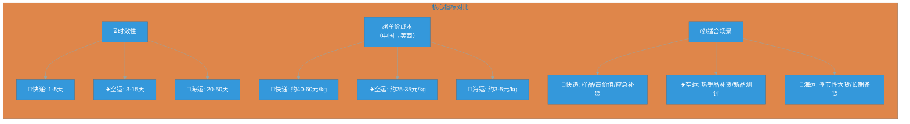

# 跨境电商小白避坑指南：海运、空运、快递到底怎么选？

很多新卖家第一次发货，最容易犯的错误不是“选贵了”，而是**选错了物流方式**。

同样一批货，走海运可能利润最高，走空运可能最稳，走快递可能最快。但如果你只看单价，不看货值、时效、体积、库存和平台规则，就会出现：

- 货还在海上，链接已经断货；
- 空运补货太贵，卖一单亏一单；
- 快递看似方便，最后被体积重、偏远费、清关费打懵；
- 旺季临时补货，物流成本直接吃掉利润。

本文用跨境电商实战逻辑，帮你一次讲清楚：**海运、空运、国际快递到底怎么选。**

---

## 一、先记住一句话：物流不是越便宜越好，而是要匹配销售节奏

> 你的货能不能在正确时间，以可接受成本，到达正确仓库。

下面这张图帮你直观对比三大渠道的核心差异：

**简化判断表**（适合快速决策）：

| 物流方式 | 适合场景 | 核心优势 | 最大风险 |
| ---- | -------------- | ------------- | ---------- |
| 海运 | 大批量、稳定补货、低货值产品 | 单位成本极低 | 慢、波动大、压库存 |
| 空运 | 中小批量、季节品、紧急补货 | 时效快于海运，成本低于快递 | 价格波动、清关要求高 |
| 国际快递 | 样品、小批量、高货值、测款 | 门到门、速度快、操作简单 | 单价高、体积重坑多 |

---

## 二、三种方式怎么选？（附避坑点）

### 1. 海运：适合“利润要稳、货量够大”的卖家

海运适合大货、重货、低货值、补货计划明确的产品（如家具、健身器材、宠物用品）。

**常见类型：**

- **整柜 FCL**：货量大、供应链稳定 → 成本最低，可控性强
- **拼箱 LCL**：货量不够整柜 → 灵活，但费用项更多
- **海运到仓**：发亚马逊 FBA/海外仓，主流模式

**💣 海运必避的坑：**

- **报价只看海运费，忽略附加费**：实际费用包含起运港费、目的港费、清关费、拖车费、旺季附加费、查验费、滞港费等。曾有小卖家被低价海运吸引，最后尾端费用比头程还高。
- **货代没有NVOCC资质**：出事无处索赔。合作前在中国交通部官网查询资质，优先选亚马逊SPN认证的服务商。
- **旺季被甩舱**：2026年美西航线舱位紧张时段溢价曾高达76%。旺季前1-2个月应签订**舱位锁定协议**，明确运费、舱位保障、涨价上限和违约赔付。
- **目的港清关资料不符**：HS编码填错、品名模糊（如“户外灯具”应写“露营灯”），会导致扣货或改单费。发货前把报关单、商业发票交给货代清关团队预审核。
- **选错集装箱类型**：轻泡货（体积大重量轻）选40HQ高柜比20GP小柜更划算——容积大2.3倍，运费只贵1.2倍左右。

### 2. 空运：适合“不能断货，但又不想全走快递”的卖家

空运适合中小批量、较高货值、季节性强、补货周期紧张的产品（爆款临时补货、节日品赶窗口、新品首批铺货）。

核心价值：**用更快的速度保护销售排名和库存安全**。

**💣 空运必避的坑：**

- **选转飞而不是直飞**：转飞便宜20%-45%，但准点率低42%，中转延误可能让你错过旺季大促。赶大促一定要选**直飞专线**。
- **低估敏感货难度**：带电、液体、化妆品、品牌货需走专门渠道。带电产品要准备UN38.3和MSDS报告。
- **忽略体积重**：空运计费重量 = 实重 和 体积重(长×宽×高cm/6000)取较大值。轻泡货（抱枕、玩具、灯具）容易吃亏，应压缩包装、提高装箱率。
- **双清包税的“灰色清关”**：报价低15%以上的渠道多采用灰色清关，被扣概率高达30%。选有信誉的正规专线，清关通过率100%才值那个价。

### 3. 国际快递：适合“小批量、高时效、高确定性”

国际快递（DHL、FedEx、UPS）特点：门到门、时效快（1-5天）、轨迹清晰、操作简单。适合寄样品、新品测款10-50件、高货值小件、紧急救急。

**💣 快递必避的坑：**

- **被体积重坑**：快递体积重系数是**/5000**（比空运更严格）。同样体积的货，快递计费重量可能比空运高20%。
- **偏远地区附加费**：美国阿拉斯加、欧洲北部等偏远地区，每公斤加收2-5美元。下单前查询服务区。
- **燃油附加费频繁调整**：2026年3-4月UPS燃油附加费从32%飙至48.5%。发货前确认当周比例，或与货代锁定附加费。

---

## 三、一张表判断：你的货该怎么发？

| 判断维度 | 选海运 | 选空运 | 选快递 |
| ---- | ------ | ------ | -------- |
| 货量 | 大批量 | 中小批量 | 小批量 |
| 时效 | 不急（20-50天） | 比较急（3-15天） | 非常急（1-5天） |
| 货值 | 低到中 | 中到高 | 高 |
| 体积 | 大件更适合 | 小中件更适合 | 小件更适合 |
| 利润率 | 低毛利更适合 | 中高毛利 | 高毛利 |
| 库存状态 | 有安全库存 | 快断货 | 已经断货 |
| 操作难度 | 中高 | 中 | 低 |

---

## 四、跨境电商常见选择公式（附实战案例）

### 公式 1：新品测款
> 快递小量测款 → 空运补一批 → 海运大货

**案例：** 你做了一款新品。先走快递发20件（成本约800元，3天到），测出转化率可以；再走空运发200kg补货（约6000元，7天到），保证不断货；确认爆款趋势后，海运大货2000kg（约8000元，30天到）接上。这样不会一次性压死库存。

### 公式 2：爆款补货
> 海运做主补货(70%-90%)，空运做安全垫(10%-30%)，快递只救急

**案例：** 单品月销500件的大件家居，重8kg。全走空运每月物流成本12万元；换成海运只需1.6万元，省下10万+元。这就是海运的成本竞争力。

### 公式 3：季节品（圣诞、万圣节等）
> 销售窗口短的产品，宁愿物流贵一点，也不要错过销售期

**案例：** 圣诞灯串如果海运到港已过旺季，再便宜也难卖。应提前海运备货，临近旺季用空运补缺口。**赶上销售窗口 > 节省一点运费。**

### 公式 4：断货救急（Prime Day前）
> 快递是“保费”，不是日常选项

**案例：** 离Prime Day只剩10天，爆款库存只够4天。走快递发200kg成本1.2万元，但保住Best Seller排名，Prime Day额外销售额数十万。关键时刻，快递成本是可以接受的保险费。

---

## 五、小白最容易踩的8个坑（浓缩精华版）

1. **只看头程报价，不看全链路成本**：物流成本 = 国内提货 + 出口报关 + 国际运输 + 目的港费用 + 清关 + 关税 + 派送 + 入仓。
2. **忽略体积重**：空运/快递按实重和体积重取大值。轻泡货要压缩包装、改箱尺寸。
3. **不做库存安全期**：安全库存天数 = 物流在途 + 清关入仓 + 上架缓冲 + 异常延误。不要把库存算太满。
4. **把快递当长期补货方式**：长期依赖快递说明供应链计划出了问题。
5. **旺季不提前订舱**：旺季前4-8周就要规划，否则面临甩舱和暴涨的运价。
6. **不确认是否包税**：问清含不含关税、清关、查验谁承担。低价包税渠道容易违规扣货。
7. **不看产品是否敏感货**：带电、液体、粉末、化妆品、儿童用品等要提前确认渠道和资料。
8. **没有备用物流方案**：至少准备一个主力海运、一个备用海运、一个空运渠道、一个快递账号、一个可中转的海外仓。

---

## 六、给新手卖家的物流配置方案（按节奏走）

| 阶段 | 推荐渠道 | 目的 |
| ---- | ------- | ---- |
| 第1阶段：测款 | 快递（10-50件） | 验证产品力，避免库存积压 |
| 第2阶段：小批量补货 | 空运（100-500kg） | 快速响应，不断货 |
| 第3阶段：稳定备货 | 海运（大货） | 拉低成本，形成价格优势 |
| 第4阶段：成熟期 | 海运+空运+快递组合 | 成本与安全的最优平衡 |

> 真正成熟的跨境卖家，不是只会找低价物流，而是会根据产品生命周期**配置物流组合**。物流选对了，是利润；选错了，是库存、断货和现金流压力。

**如果这篇文章对你有用，也欢迎分享给正在跨境路上摸索的朋友。**
